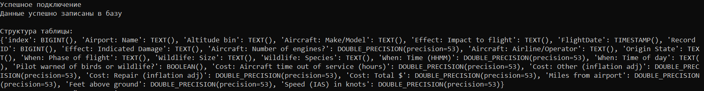

<h1 id="header" align="center">
Data-engineering

  
## Датасет
Обрабатывается набор данных о столкновениях птиц с воздушными судами в США за период с 2000 по 2011 годы.

**Ссылка на датасет**: [Bird Strikes Dataset на Kaggle](https://www.kaggle.com/datasets/breana/bird-strikes)
# Руководство по обработке датасета

## Настройка проекта
### Создать виртуальное окружение с помощью  conda + poetry
```
conda create -n my_env python=3.13 pip
conda activate my_env

pip install poetry
poetry new my_project

cd my_project
poetry add jupyterlab pandas matplotlib wget
poetry install —no-root
```

## Структура проекта

```
dde_etl/
│
├── etl/
│   ├── __init__.py
│   ├── extract.py     # Извлечение данных из внешнего источника (Google Drive)
│   ├── load.py        # Сохранение в Parquet и загрузка в базу данных
│   ├── main.py        # Основной модуль процесса ETL
│   └── transform.py   # Преобразование данных
│
└── README.md
```

## Запуск ETL
Сохранить проект и убедиться, что рядом есть .env файл (для базы данных), например:

```
db_user = user
db_password = 123
db_url = url
db_port = 5432
```

Выпонить команду: 
```
python -m etl.main --url https://drive.google.com/uc?id=XXXX
```

После запуска скрипт выполняет следующее:

## Загрузка данных с Google Drive

Сохраняет данные в папку data\raw

Отображает первые 10 строк датасета для проверки:


Показывает информацию о количестве записей и типах данных.


## Приведение типов данных и сохранение датасета

Исходный датасет содержит 65,610 записей и 23 признака. Данные до обработки выводятся таблицей при помощи команды:

```
print(df.info())
```

Проведены следующие преобразования:

1. Преобразованы даты в столбце 'FlightDate'

2. Преобразованы числовые колонки

Стоимостные показатели: Cost: Total $, Cost: Repair, Cost: Other, Cost: Aircraft time out of service (hours)

Параметры полета: Speed (IAS) in knots, Feet above ground, Miles from airport, Aircraft: Number of engines?

3. Категориальные данные

Преобразованы колонки с малым количеством уникальных значений:

Airport: Name, Wildlife: Species', Effect: Indicated Damage, When: Phase of flight, When: Time of day 

## Результаты оптимизации

До обработки: 21 колонка типа object

После обработки:

float64: 9 колонок

category: 5 колонки

datetime64[ns]: 1 колонка

int64: 1 колонка

object: 7 колонок

float64: 9 колонок

Результат обработки:


Обработанные файлы сохраняются в папку data\processed в формате **Parquet**

## Загрузка в Базу Данных

Загружает первые 50 строк в базу данных




```
ETL процесс завершён успешно!
```

## EDA

Анализ и работа с данными в EDA представлены в файле [EDA.ipynb](notebooks/EDA.ipynb)
