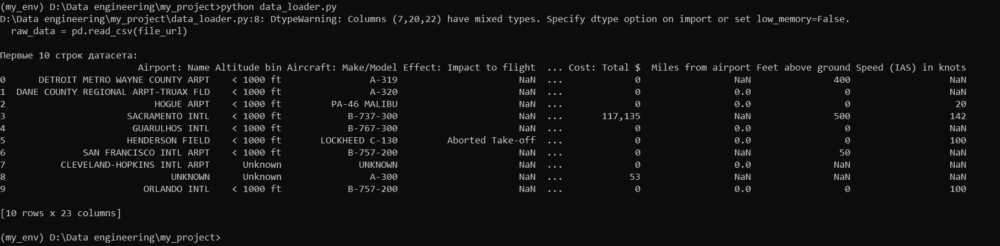
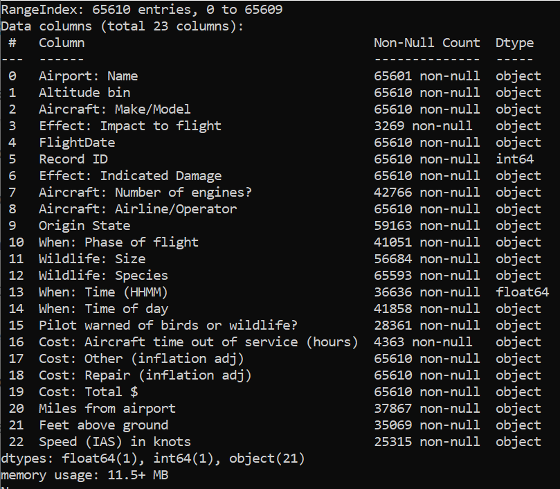
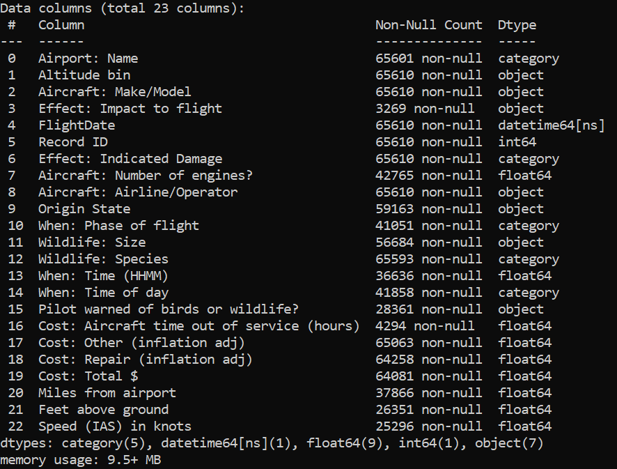

# Data-engineering
## Датасет
Обрабатывается набор данных о столкновениях птиц с воздушными судами в США за период с 2000 по 2011 годы.

**Ссылка на датасет**: [Bird Strikes Dataset на Kaggle](https://www.kaggle.com/datasets/breana/bird-strikes)
# Руководство по обработке датасета

## Настройка проекта
### Создать виртуальное окружение с помощью  conda + poetry
```
conda create -n my_env python=3.13 pip
conda activate my_env

pip install poetry
poetry new my_project

cd my_project
poetry add jupyterlab pandas matplotlib wget
poetry install —no-root
```
Загрузка и обработка данных

```python data_loader.py```

Данный скрипт выполняет следующее:

Загружает данные с Google Drive

Отображает первые 10 строк датасета для проверки:



Показывает информацию о количестве записей и типах данных для всех переменных.



# Приведение типов данных и сохранение датасета
Исследование данных проводилось с целью выявления ошибочных данных, пустых значений (NaN) и оптимизации типов данных в основном файле data_loader.py.

Исходный датасет содержит 65,610 записей и 23 признака. Данные до обработки выводятся таблицей при помощи команды:

```
print(raw_data.info())
```

Были проведены следующие преобразования:

1. Преобразованы даты в столбце 'FlightDate'

2. Преобразование числовых колонок

Стоимостные показатели: Cost: Total $, Cost: Repair, Cost: Other

Параметры полета: Speed (IAS) in knots, Feet above ground, Miles from airport

Временные показатели: When: Time (HHMM), Aircraft: Number of engines?

3. Категориальные данные

Преобразованы колонки с малым количеством уникальных значений:

Effect: Indicated Damage, When: Phase of flight, When: Time of day → category

## Результаты оптимизации

До обработки: 23 колонки типа object

После обработки:

float64: 9 колонок

category: 5 колонки

datetime64[ns]: 1 колонка

int64: 1 колонка

object: 7 колонок

float64: 9 колонок

Сохранены обработанные данные в формате CSV

Результат обработки:



Обработанные файлы сохраняются в папку data/ и могут использоваться для дальнейшего анализа и визуализации.


