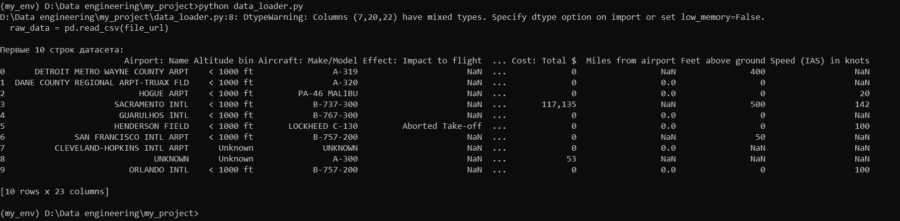
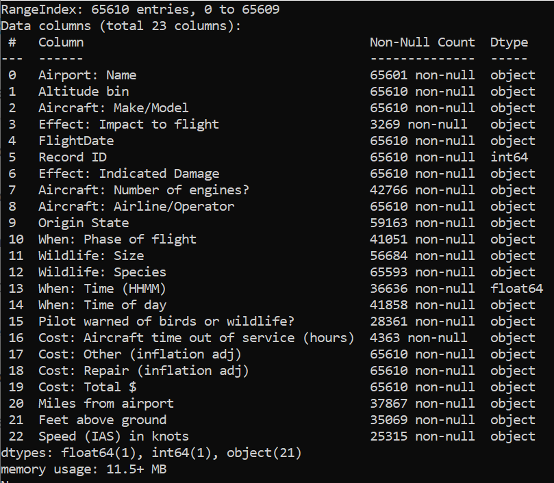

# Data-engineering

**Ссылка на датасет**: [Bird Strikes Dataset на Kaggle](https://www.kaggle.com/datasets/breana/bird-strikes)

## Настройка проекта
### Создать виртуальное окружение с помощью  conda + poetry
```conda create -n my_env python=3.13 pip
conda activate my_env

pip install poetry
poetry new my_project

cd my_project
poetry add jupyterlab pandas matplotlib wget
poetry install —no-root
```
Загрузка и обработка данных

```python data_loader.py```

Данный скрипт выполняет следующее:

Загружает данные с Google Drive

Отображает первые 10 строк датасета для проверки:



Показывает информацию о количестве записей и типах данных для всех переменных.



Выполняет приведение типов данных:

Преобразует даты в столбце 'FlightDate'

Конвертирует числовые значения (затраты, высота, скорость)

Обрабатывает категориальные данные (виды птиц, аэропорты, этап полета, последствия)

Сохраняет обработанные данные в формате CSV


