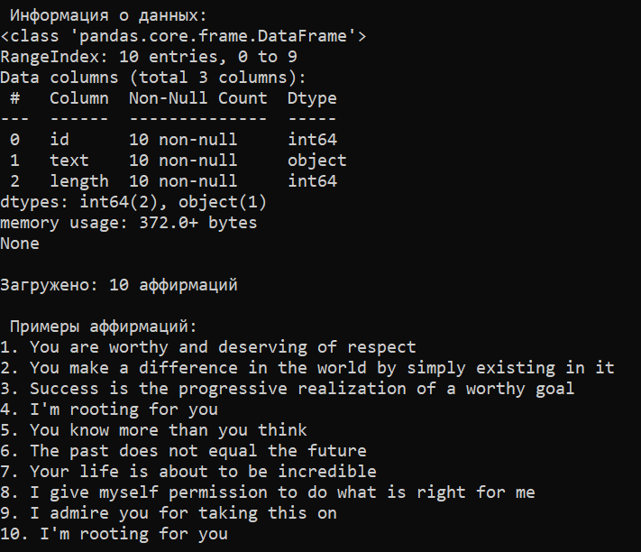

#  Описание проекта

Этот проект загружает аффирмации из интернета и сохраняет их в файлы

[**Affirmations API**](https://www.affirmations.dev/)
## Как запустить программу?

1. Установить Python
2. Установить библиотеки: `pip install pandas requests`
3. Запустить программу: `python api_reader.py`

## Что делает программа?
- Загружает 10 случайных аффирмаций
- Сохраняет их в файл CSV
- Сохраняет в текстовый файл
- Показывает статистику

## Пример аффирмаций
1. You are worthy and deserving of respect
2. You make a difference in the world by simply existing in it
3. Success is the progressive realization of a worthy goal
4. I'm rooting for you
5. You know more than you think

